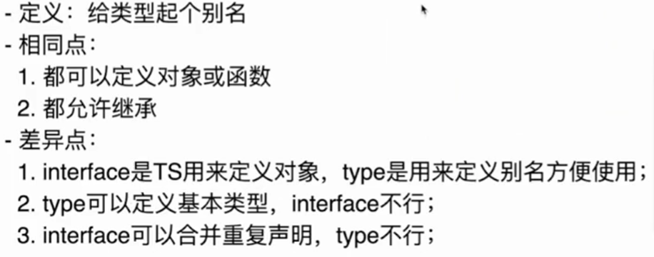

# 深入浅出Typescript

## 基础类型

1. boolean, number, string

2. 枚举enum

   ::: code-group

   ```typescript[enum.ts]
   enum Fruit {
       apple, // 0
       orange, // 1
       banana // 2
   }
   
   enum Fruit2 {
       apple2 = 1, // 1
       orange2, // 2
       banana2 = 100, // 100
       watermelon2 // 101
   }
   ```

   ```javascript[enum.js]
   "use strict"
   var Fruit;
   (function (Fruit)) {
    	Fruit[Fruit["apple"] = 0] = "apple";
   	Fruit[Fruit["orange"] = 1] = "orange";
   	Fruit[Fruit["banana"] = 2] = "banana";
   })(Fruit || (Fruit = {}));
   
   var Fruit2;
   (function (Fruit2)) {
    	Fruit[Fruit["apple2"] = 1] = "apple2";
   	Fruit[Fruit["orange2"] = 2] = "orange2";
   	Fruit[Fruit["banana2"] = 100] = "banana2";
   	Fruit[Fruit["watermelon2"] = 101] = "watermelon2";	
   })(Fruit2 || (Fruit2 = {}));
   ```

   :::

   正反映射:information_desk_person:: `Fruit["A"] = 0 <-> Fruit[0] = "A"`， 即`key`与`value`一一对应

3. any, unknown, void

   `unknown`是`any`的一个代替类型，`unknown`只能被赋值。

4. never

   `never`表示那些永远不会存在的值，标明错误的返回状态。

   ```ts
   function test(x: string | number): boolean {
       if (typeof x === 'string') {
           return true;
       } else if (typeof x === 'number') {
           return false;
       }
       return throwError('参数格式有误');
   }
   
   function throwError(message: string): never {
       throw new Error(message);
   }
   ```

   

5. 数据类型 []

6. 元组类型 tuple

7. 函数类型
   定义：TS定义函数类型要定义输入参数类型和返回值类型

   输入参数：参数支持可选参数和默认参数

   输出参数：输出可以自动推断，也可以定义，没有返回值的时候定义为void

   函数重载：名称相同但是参数不同，可以通过重载支持多种类型参数

    ```ts
    function add(x: number[]): number 
    function add(x: string[]): string
    function add(x: any[]): any {
        if (typeof x[0] === 'string') {
            return x.join();
        }
        if (typeof x[0] === 'number') {
            return x.reduce((prev, current)=> prev + current);
        }
    }

8. 接口 interface

   定义：接口是为了定义`Object`类型

   特点：

   - 可选: ?
   - 只读：`readonly`
   - 可以描述函数类型
   - 可以描述自定义属性

9. 类

   特点：

   - 增加了 `public`, `private`, `protected`
   - 抽象类：
     - 只能被继承，不能被实例化
     - 作为基类，抽象方法必须被子类实现
   - `interface` 约束类，使用`implements`关键字


## 高级类型

1. 联合类型 `|`

2. 交叉类型 `&`

3. 类型断言 `as xxx`

4. 类型别名 `type`

   

5. 泛型 `<T>`

​	::: tip 一个🌰

​	:::
