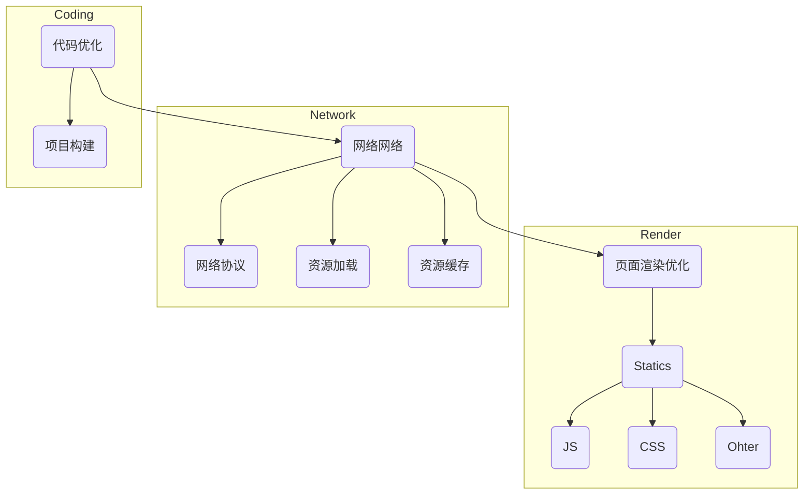

# 前端性能优化<Badge type="tip" text="NEW" />


::: details 本文逻辑顺序



:::


## 项目编码与构建

### 编码

#### 1. 动态引入

一些常见的动态引入(`dynamic import`)表达式

```js
// 模板字符串
import(`./icons/arrow-${type}.svg`);
require(`./icons/arrow-${type}.svg`);

// 二元表示式
import('./icons/arrow-' + type + '.svg');

// 直接引入一个变量
import(path);
require(path);
```

::: code-group 举个🌰

``` js [待转换]
function importLocale(locale) {
    return import(`./locales/${locale}.js`);
}
```

```js [转换后]
function __variableDynamicImportRuntime__(path) {
  switch (path) {
    case './locales/en-GB.js':
      return import('./locales/en-GB.js');
    case './locales/en-US.js':
      return import('./locales/en-US.js');
    case './locales/nl-NL.js':
      return import('./locales/nl-NL.js');
    default:
      return new Promise(function (resolve, reject) {
        queueMicrotask(reject.bind(null, new Error('Unknown variable dynamic import: ' + path)));
      });
  }
}

function importLocale(locale) {
  return __variableDynamicImportRuntime__(`./locales/${locale}.js`);
}
```

:::

**实际上`import`被替换成了注入的`__variableDynamicImportRuntime__`函数，该函数会根据运行拼接的具体字符串返回对应的打包文件。**

::: warning 一些导入规则 🧙

**(1) 所有导入都必须相对于导入文件进行**。（不能够是纯变量、绝对路径或裸导入）

```js
// Not Allowed
import 'bar'; // 纯变量
import (`/foo/${bar}.js`); // 绝对路径
import(`${bar}.js`); // 裸导入
```

**(2) 引用路径需包含文件后缀**

```js
import(`./foo/${bar}`); // Not allowed
import(`./foo/${bar}.js`); // Allowed
```

**(3) 导入当前目录的文件需要指定具体的文件匹配格式**

```js
import(`./${foo}.js`); // not allowed
import(`./module-${foo}.js`); // allowed
```

**(4) 通配符（Glob Pattern）仅有一层深度**

```js
import(`./foo/${x}${y}/${z}.js`); // -> './foo/*/*.js' 而非 './foo/**/*.js' 
```

:::

#### 2. 按需引入

在使用第三方组件库的时候按需引入，与之相对的是全量引入。（一般每个第三方组件库都有对应的教程）

```js
import { Button } from 'Vant';
```

#### 3. 异步加载

```js
// import 懒加载
() => import('@/pages/xxx.vue');
// require 懒加载
resolve = require(['@/pages/xxx.vue'], resolve);

// 一个实例 - 路由懒加载
{
    path: '/index',
    name: 'index',
    component: () => import("@/view/xxx.vue");
    meta: {title: '首页'}
}
```

### 打包构建

#### 1. resolve

```typescript
// vite.config.ts
import {defineConfig} from 'vite';

export default defineConfig({
    // ...
    resolve: {
        extensions: ['.ts', '.js'],
        alias: {
            '@': './src',
        }
    }
});
```

- alias

  - 配置别名
  - 每个模块的路径都需要进行解析，解析是比较耗时的，使用别名的时候，打包工具会直接按照别名对应的路径映射过去，提高了打包速度

- extensions

  当引入方式为: `import('@/data')`，`vite`会自动根据`extensions`里的顺序依次查找后缀，本示例中会优先找`data.ts`，若找不到则找`data.js`若还是找不到就报错。因此，`extensions`要尽量按照出现频率优先排序，并且不要把项目中不存在的后缀引入`extensions`中，引入的时候可以考虑带上后缀。

#### 2. Webpack缩小loader范围

​	配置`loader`的时候，通过`include`和`except`缩小`loader`的执行范围。

```js
{
    test: /\.svg$/,
    loader: 'svg-sprite-loader',
    include: [resolve('src/icons')]
}
```

#### 3. chunks分包打包

```typescript
// vite.config.ts
// 自定义分包
import { defineConfig } from 'vite';

export default defineConfig({
    build: {
        rollupOptions: {
            output: {
                // key为自定义的名称，[]中插件同步package.json的名称或者src目录下的相对路径
                manualChunks: {
                    vue: ['vue', 'vue-router', 'pinia', 'vue-i18n'],
                    echarts: ['echarts'],
                    lodash: ['loadash']
                    // ...
                }
            }
        }
    }
})
```

::: tip 分包的好处：

​	当我们访问一个页面的时候，如果不进行分包，我们将发送一次HTTP请求获取整个页面的包，此时一个包大小可能很大，请求所需要的时间可能很长；当我们分包构建的时候，只有当需要时，才会对对应的包进行动态请求，这样，能够避免发起请求以及使用额外的带宽。

​	不仅如此，分包构建后不同的包会根据包的内容计算`hash`值，如果某个包内容没有变化，他的`hash`值也不会改变，这样浏览器就能够直接从`缓存`中获取所需的包，从而节省了网络请求时间和带宽。而对于改变了内容的部分，由于其hash值已经发生了变化，浏览器无法从缓存中获取，需要重新发起网络请求获取最新的资源。这样既保证了网站的实时性，又减少了不必要的网络请求，提高了页面的加载速度和用户体验。

:::

::: danger 分包一些需要注意的问题‼️‼️

​	在实战里面有因为分包出现的性能 负向影响 的问题。

​	具体参考[前端性能优化 —— 实战](/front/前端性能优化——实战.html)

:::

#### 4. Tree Shaking

​	`Tree Shaking` 是指在打包时，将未被引用的模块代码剔除掉，从而减小最终打包后的文件大小。`Tree Shaking` 依赖于 ES6 的模块系统和静态语法分析，可以在编译阶段分析出哪些模块没有被使用，然后在打包时将这些模块移除。`Tree Shaking` 通过去掉没有使用的代码，从而减小了最终打包文件的体积，提高了应用的加载速度。

> Tree Shaking 与 按需导入的区别：
>
> ​	`按需导入`是指只加载当前需要的模块，而不是将整个模块全部加载进来。按需导入通常用于优化页面加载速度。例如，在一个大型应用中，可能存在某些功能只在特定情况下才会被使用，这时候可以使用按需导入，只在需要使用时加载对应的模块，减小了应用的启动时间和加载时间。
>
> ​	按需引入相当于选择需要引入的模块或者代码片段，而Tree Shaking 是通过静态分析代码中的依赖关系，自动地将代码中没有使用的部分删除掉，以减小打包后的文件体积。

#### 5. `Vite`<Badge type="tip" text="4.3" /> - `Warm Up` - `SWC`

##### (1) Warm Up

::: details warmup插件原文

​	Vite at it's core is an on-demand file server. When a request comes in, it will transform the file and serve it. This means we only do the work that is requested, keeping the dev server fast.

​	However, sometimes we know in advance which files will be requested when we start our development cycle. Instead of Vite idling before we open up the page, we can start transforming the files beforehand so when it gets requested, it's cached and can be served immediately.

:::

​	`Vite`的一个核心就是在于他是一个**按需提供文件的服务(On-demand file server)**，当有请求的时候，`Vite`才会把浏览器不懂的`Vue/JSX`等文件转为对应的`HTML/CSS/JS`，只有当请求的时候才去工作。

​	但是有些时候，有一些文件我们是知道一定会被请求到的，于是我们可以提前开始转换文件，这样当它被请求时，就可以使用他的缓存立即提供服务。

​	即将一些文件的渲染提前到`Init`而非`Listen`。

用法：

```js
// vite.config.js
import { defineConfig } from 'vite'
import { warmup } from 'vite-plugin-warmup'

export default defineConfig({
  plugins: [
    warmup({
      // warm up the files and its imported JS modules recursively
      clientFiles: ['./**/*.html', './src/components/*.jsx']
    })
  ]
})
```


##### (2) [SWC](https://swc.rs/) —— 更快的`Babel`


::: tip

​	从这里开始按照 [浏览器渲染过程](/front/浏览器渲染过程.html) 介绍优化方案。

:::

## 网络请求

### URL解析

DNS解析
- DNS预解析 `rel = "dns-prefetch"` （另一个预解析是`rel = "prefetch"`，可能会出现的问题参考[实战](/front/前端性能优化——实战)）
- DNS负载均衡（[CDN](/webs/CDN.html)）
- DNS缓存

### TCP/IP 握手

### 资源缓存

1. [HTTP缓存](/webs/HTTP缓存.html)

2. 浏览器缓存 [Cookies, LocalStorage, IndexDB, BFCache(往返缓存)]

3. AJAX GET请求缓存

   AJAX请求成功后，会把请求的`URL`以及返回的响应结果存储在缓存中，针对相同的`GET`请求（`URL`与`Params`完全相同），会直接从缓存中拿数据。

### HTTP请求

`HTTP/1.1 -> HTTP/2.0`

​	当浏览器建立HTTP链接的时候，由于浏览器的策略限制，针对==同一个域名==的请求，同一个`GET`请求，由于缓存的原因，会阻塞（即一个一个执行），但是一定条件下（等待==20s==后）会变为并发；对于不同的`GET/POST`请求，浏览器限制其并发`TCP`链接数最多为6个（Chrome），其原因在于`HTTP/1.1`的队头阻塞。

- 其中一个解决方案：`HTTP/2.0`的多路复用、二进制分帧、头部压缩等能够解决该问题，升级到`HTTP/2.0`也可以突破该限制。具体区别可以参考[HTTP版本差异](/webs/HTTP版本差异.html)


- 另一个解决方案：把资源分发到不同的域名，这样就可以并发获取了（CDN）。


## 页面渲染

### 1. 减少页面重绘与回流

- ✨减少css属性简写，如：用`flex-grow`, `flex-shrink`, `flex-basis`代替`flex`，因为css简写将所有值初始化为`initial`
- ✨通过修改`className`批量修改元素样式
- ✨复杂动画元素定位设置为`fixed/absolute`，避免引起回流
- ✨避免使用`table`布局，因为一旦回流会导致`table`所有元素回流
- ✨创建多个DOM节点，使用`DocumentFragment`一次创建
- ✨CSS3硬件加速，使用`transform`/`opacity`/`filter`等动画不触发回流重绘
- ✨尽量定义高度或最小高度，否则页面内容动态加载的时候，会出现页面元素的晃动或位置的变化，引起回流
- ✨大量修改元素样式的时候，可以先设置`display:none`隐藏，修改完后再设置为`display:block`

### 2. 图片压缩、分割

- 🎈压缩图片大小（tinyPng）
- 🎈图片分割，将一张图片分割成多分，最后使用CSS拼接
- 🎈雪碧图（精灵图🧝‍），将多张图片合成一张图片，使用CSS`background-position`定位图片并且展示。

### 3. 字体压缩

​	`font-spider🕷` 提取所需的字体加载（按需加载）

### 4. 懒加载/预加载

- 🎉[懒加载](/javascript/lazyload)：只有当图片到达视窗再进行加载 

- 🎉预加载：Resource Hints(资源预加载)包括预连接、资源与获取、资源预渲染等

