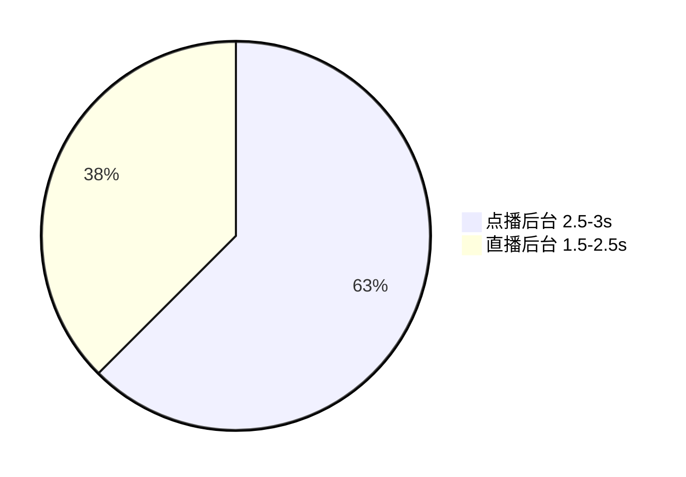

# 白屏优化

## 优化背景 (加载时间对比)



## 为什么需要优化白屏（FCP）时间

- 增强用户体验
- 提升页面留存率


## 分析原因

### 1. 二者区别

- 点播后台使用`Vue-Cli 4`，而直播后台使用`Vue-Cli 5`
- 在加载流程上，点播后台共有==295==次请求而直播后台仅==53==次请求，其中，==295==有200+是细碎的`chunks`文件

### 2. 原因

- 细碎`chunks`提前请求阻塞了页面资源的请求与加载，这些文件都通过`prefetch`进行预加载，导致其他资源请求延后

- `chunks`体积很小，但是数量过多，而浏览器一般对同一个==域名==的请求有所限制（Chrome一般不多于6个），导致等待200多个请求需要花费大量时间。

  ::: tips 一个补充

  Chrome确实是对同一个域名下的并发请求的个数是有限制的，不同的`GET/POST`请求的限制为6个（使用`HTTP/2.0+` 或者 `HTTPS`即可突破)，而==同一个==`GET`请求，会依次一个一个的执行。

  但是当请求静止等待==20s==后，这些剩余的相同`GET`请求照样会并发。这里的原因在于：Chrome浏览器的==get请求缓存==，对于同一个URL+相同参数向后台发送请求的时候，如果前一个请求未执行后一个请求将被阻塞，而阻塞的时间最长为==20s==。

  :::

- 有的`JS`文件没有被压缩


## 解决方案

### 1. 针对细碎`chunks prefetch ` 的情况

::: tip

- 什么是`prefetch`

  预提取(`prefetch`)是一种浏览器机制，利用浏览器的==空闲时间==加载用户在将来的不久可能会访问到的资源，并且缓存到内存中。

  在实际调用的时候，可以节省资源加载的时间。

- 为什么会出现`prefetch`

  原因在于`Vue-Cli 4`默认开启了`PreloadPlugin`插件，他会把资源的link添加`html`中，并且添加上`rel="prefetch"`，而`Vue-Cli 5`是默认关闭的。

  

- 为什么`prefetch`会在页面资源加载前去加载呢 🕵️

  这与浏览器的加载机制相关，`空闲时间`实际上指的是==高优先级任务的间隔时间==，在这个时间会用来加载低优先级任务。这个时间并不是我们所想的等所有高优先级任务加载好后再进行加载。

  

:::

#### 方案：

1. 直接关闭`preFetch`（与`Vue-Cli 5`一样）
2. 利用定时器，将加载的顺序按照我们所想的那样做


这里说一下如何实现第二种方法。

::: tip 如何判断DOM是否已经加载成功？

以下方法能够成功获取到DOM元素后，说明页面加载完成了

```js
addEvent(window, "load", function () {
	// ...
})

document

document.getElementByTagName('...')
document.getElementById('...')
document.querySelector('...')

document.body
```

- 通过`轮询`判断是否能够获取到`DOM`，如果已经获取到某个`DOM`元素，说明加载完成既可以加载`prefetch`资源
- 该`DOM`元素必须每个页面都包含

```js
//延迟加载prefetch资源
let timer =  setInterval(function() {
    //由于.p-live-admin-app被获取到时页面已加载完成，
    //通过轮询判断是否有该元素来判断页面是否加载完成
    //从而加载prefetch 资源
	const lastChild =  document.querySelector('.p-live-admin-app');
    if (lastchild){
        loadChunks({
        chunks:['']
        assetTypes:['css','js'],
        prefetch:true,
        allChunkData
    	});
        window.clearInterval(timer);
        timer = null;
	}
},3000);
```

:::

​	

### 2. 针对过多细碎`js/css`

#### 方案：

通过`WebPack`插件在打包时把细碎的`js`与`css`合并。

通过`MinChunkSizePlugin`插件，合并小于`minChunkSize`的文件保持`chunk`的最小大小，单位是`Byte`。

```js
// webpack.config.js

// ...
this.minChunkSizePlugin = new webpack.optimize.minChunkSizePlugin({
    minChunkSize: this.minChunkSize,
})
```


### 3. 针对某些`JS`文件没有压缩

#### 方案

- 手动使用指令压缩代码，并且手动`inline`
- 自定义插件实现每次打包的时候自动操作

###### 压缩: `terser | uglify`

```js
// terser
const fs = require('fs');
const { minify } = require('terser');
const result = minify(fs.readFileSync(file, 'utf-8'));

// uglify
const fs = require('fs');
const { minify } = require('uglify-js');
const result = minify(fs.readFileSync(file, 'utf-8'));
```

###### 内联：获取`HTML`后将`JS`放入`body`后的`script`标签中

```js
inlineJs(optionPath, htmlData) {
    const str = minify(fs.readFileSync(optionPath, 'utf-8'), {}).code || ''; // optionPath为需要压缩内联的JS的路径
    const scriptCode = `<script>${str}</script>` || '';
    const htmlStr = htmlData.html.toString();
    return htmlStr.replace(new RegExp('</body>', 'g'), scriptCode + '</body>'); // 内联至body最后面
    
}
```

###### 处理时机：在`html-webpack-plugin`的`htmlWebpackPluginAfterHtmlProcessing`钩子中获取`html`

```js
compilation.hooks.htmlWebpackPluginAfterHtmlProcessing.tap
('GenTemplatePlugin',htmlData => {
    if (htmlData.plugin.options.meta.moreTemplateDisabled) return;
	htmlData.html = this.removeLink(htmlData);
	htmlData.html = this.inlineJs(this.loadPath, htmlData);
});
```


## 代码总结

```js
const AssetsPlugin = require('assets-webpack-plugin');
const webpack = require('webpack');
const fs = require('fs');
const minify = require('terser');

class GenTemplatePlugin {
    constructor(options) {
        this.options = options || '';
        this.minChunkSize = this.options.minChunkSize;
        this.loadPath=this.options.loadPath; // loadAssets.js文件的位置
		this.outputPath=this,ptions.outputPath; // 生成多模板加截文件的位置
        this.filename=this.options.filename;// 生成多模板加载文件的名称
		this.resources=this.options.resources;// 除chunk外的资源文件
		this.minChunkSizePlugin = new webpack.optimize.MinChunkSizePlugin({
    		minChunkSize: this.minChunkSize,
		});
		this.assetsPlugin = new AssetsPlugin({
    		filename:this.filename,
    		prettyPrint:false,
    		path:this.outputPath,
    		includeAllFileTypes:false
        });
    }
}
```

