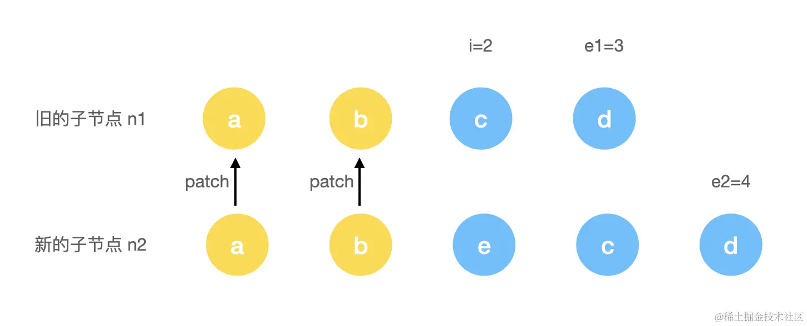
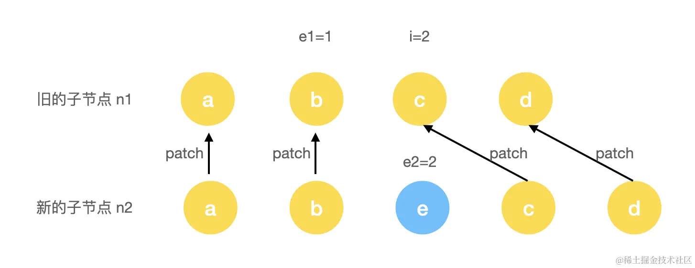
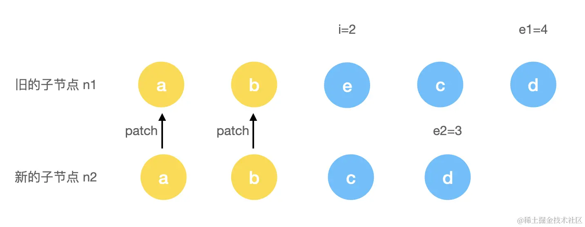
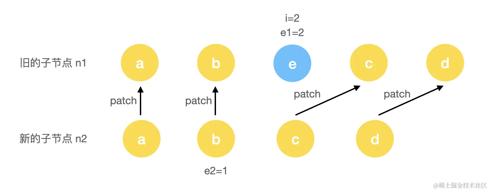
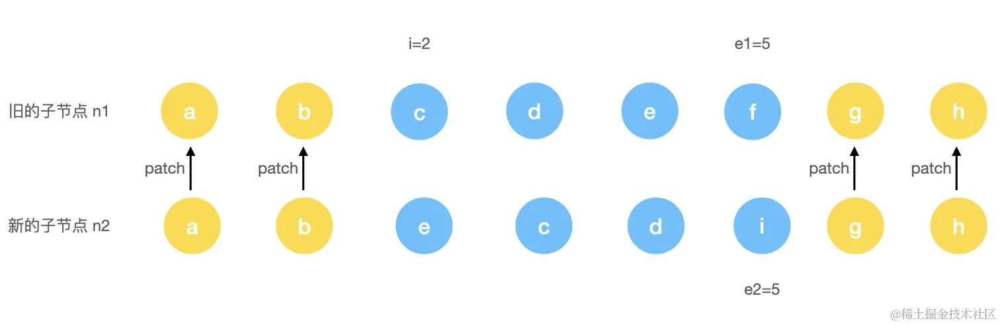
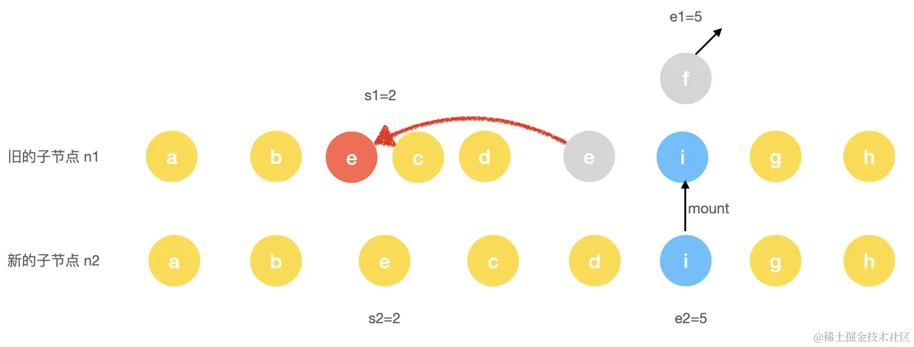

# diff与patch算法

## Vue2与Vue3 diff概括

在`Vue2`中，`diff`算法可以归结为：

1. 头和头比
2. 尾和尾比
3. 头和尾比
4. 尾和头比
5. 都没有命中的对比

而在`Vue3`中，`diff`算法被优化为：

1. 头和头比
2. 尾和尾比
3. 基于最长递增子序列进行移动/添加/删除

## 解读

### 1. 从头比对

首先，对新旧节点`c1, c2`，定义了以下几个指针：

- `i=0`，该指针指向头部的标记位
- `e1 = c1.length - 1` ，该指针指向`c1`的尾部
- `l2 = c2.length; e2 = l2 -1`，该指针指向c2的尾部

```js
const patchKeyedChildren = (c1, c2, container, parentAnchor, parentComponent, parentSuspense, isSVG, optimized) => {
    let i = 0;
    const l2 = c2.length;
    let e1 = c1.length - 1;
    let e2 = l2 - 1;
    // 从头开始比对
    while(i<=e1 && i<=e2) {
        const n1 = c1[i];
        const n2 = c2[i]; // 这里简化了一些内容
        if (isSameVNodeType(n1, n2)) {
            patch(n1, n2, container, parentAnchor, parentComponent, parentSuspense, isSVG, optimized); // 如果是sameVNode则递归patch
        } else {
            break;
        }
        i++;
    }
}
```

### 2. 从尾比对

```js
const patchKeyedChildren = (c1, c2, container, parentAnchor, parentComponent, parentSuspense, isSVG, optimized) => {
    let i = 0;
    const l2 = c2.length;
    let e1 = c1.length - 1;
    let e2 = l2 - 1;
    // 从头开始比对
    // ...
    // 
    // 尾比对
    while(i<=e1 && i<=e2) {
        const n1 = c1[e1];
        const n2 = c2[e2]; // 简化了一些内容
        if (isSameVNodeType(n1, n2)) {
            patch(n1, n2, container, parentAnchor, parentComponent, parentSuspense, isSVG, optimized); // 如果是sameVNode则递归patch
        } else {
            break;
        }
        e1--;
        e2--;
    }
}	

```

### 3. 在上面基础上实现新增/删除节点

#### (1) 新增节点

```html
<!-- c1 -->
<ul>
    <li key="a">a</li>
    <li key="a">b</li>
    <li key="a">c</li>
    <li key="a">d</li>
</ul>

<!-- c2 -->
<ul>
    <li key="a">a</li>
    <li key="a">b</li>
    <li key="a">e</li>
    <li key="a">c</li>
    <li key="a">d</li>
</ul>


```



第一步执行完，此时会对`a, b`两个进行`patch`。当`i=2`的时候，由于此时两个节点不一致，所以进入到尾部对比流程。



当前执行完后，会完成`c, d`两个节点的`patch`操作，此时由于`e1<i`，因此尾对比流程结束了，发现多了一个`key=e`的新节点，因此我们需要进行新增节点操作。

```js
const patchKeyedChildren = (c1, c2, container, parentAnchor, parentComponent, parentSuspense, isSVG, optimized) => {
    let i = 0;
    const l2 = c2.length;
    let e1 = c1.length - 1;
    let e2 = l2 - 1;
    // 从头开始比对
    // ...
    
    // 尾比对
    // ...
    
    // 新增节点操作
    if (i>e1) {
        if(i<=e2) {
     		const nextPos = e2 + 1;
            const anchor = nextPos < l2 ? c2[nextPos].el : parentAnchor;
            while(i<=e2) {
                patch(null, c2[i], anchor, parentComponent, parentSuspense, isSVG); // patch新增节点
                i++;
            }
        }
    }
}	
```

#### (2)删除节点

```html
<!-- c1 -->
<ul>
    <li key="a">a</li>
    <li key="a">b</li>
    <li key="a">e</li>
    <li key="a">c</li>
    <li key="a">d</li>
</ul>


<!-- c2 -->
<ul>
    <li key="a">a</li>
    <li key="a">b</li>
    <li key="a">c</li>
    <li key="a">d</li>
</ul>
```





事实上与新增节点操作类似，只是由`c2`多变成了`c1`多

```js
const patchKeyedChildren = (c1, c2, container, parentAnchor, parentComponent, parentSuspense, isSVG, optimized) => {
    let i = 0;
    const l2 = c2.length;
    let e1 = c1.length - 1;
    let e2 = l2 - 1;
    // 从头开始比对
    // ...
    
    // 尾比对
    // ...
    
    // 新增节点操作
    // ...
    
    // 删除节点操作
    else if (i>e2) {
        while (i<=e1) {
            unmount(c1[i], parentComponent, parentSuspense, true);
            i++;
        }
    }
}
```

## 如果二者都不满足呢？（源码里面叫Unknown Squence）



这种情况下，`i<e1&&i<e2`。

:::tip 一个前提

DOM更新的时候，性能优劣关系大致如下：属性更新 > 位置移动 > 增删节点。所以，我们尽量复用老节点，作属性更新操作，减少移动次数和增删节点次数。即尽量使用`patch`更新，实在不行再使用`move`移动节点

:::

### Vue的实现

#### 1. 新旧位置找相同直接patch

(1) build key:index map for newChildren

即：构建新序列的key:index哈希表，用于旧节点搜索新位置。

```js
const patchKeyedChildren(...args) {
    // ...
    else {
        const keyToNewIndexMap = new Map();
        for(let i=s2;i<=e2;i++) {
            const newChild = c2[i]; // 省略一个optimize
            if(newChild != null) {
                keyToNewIndexMap.set(newChild, i);
            }
        }
	}
}

```

(2) 查找旧节点在新节点的位置

- 如果旧节点不在新节点中，即`keyToNewIndexMap`中找不到对应的`index`，则`unmount`这个旧节点
- 否则，`patch`这两个对应的节点
- 如果旧节点访问完成还有新的剩余，则`patch(null, nextChild, container...)`，新增这个新节点
- 如果遍历过程中需要移动，则寻找**最长公共递增子序列**，进行最小位置移动。

```js
else {
    // ... KeyToNewIndexMap
    let patched = 0; // 已经更新的节点数
    let toBePatched = e2 - s2 + 1; // 需要进行更新的节点数
    let moved = false; // 标记是否需要节点移动
    let maxNewIndexSoFar = 0; // 标记是否有节点进行了位置移动'
    // works as Map<newIndex, oldIndex>
    // Note that oldIndex is offset by +1
    // and oldIndex = 0 is a special value indicating the new node has
    // no corresponding old node.
    // used for determining longest stable subsequence
    const newIndexToOldIndexMap = new Array(toBePatched).fill(0); // 记录新节点在旧节点的位置数组，并填满0，这里源码用了for遍历优化一些性能吧
    // 开始遍历旧节点查新位置
    for(let i=s1;i<=e1;i++){
        const prevChild = c1[i];
        // 所有新节点已经patched了，所以剩下的需要删除
        if(pathed>=toBePatched) {
            unmount(prevChild, parentComponent, parentSuspense, true);
            continue;
        }
        let newIndex;
        if(prevChild.key != null) {
            newIndex = = keyToNewIndexMap.get(prevChild); // 旧节点的新位置
        } else {
            // 如果没有key(key-less node)，只能找新节点中相同类型且没有key的节点
            for(j=s2;j<=e2;j++) {
                if(
                	newIndexToOldIndexMap[j-s2] === 0 &&
                    isSameVNodeType(prevChild, c2[j])
                ) {
                    newIndex = j;
                    break;
                }
            }
        }
        if(newIndex === undefined) {
            unmount(prevChild, parentComponent, parentSuspense, true); // 找不到
            break;
        } else {
            newIndexToOldIndexMap[newIndex-s2] = i+1; // work as Map<newIndex, oldIndex>, oldIndex is offset by +1，主要是为了避免i为0的特殊情况
            if (newIndex>=maxNewIndexSoFar) {
                // 如果没有移动，那么index一定是增序的，否则一定有移动过
                maxNewIndexSoFar = newIndex;
            } else {
                moved = true;
            }
            // patch新旧相同key节点
            patch(prevChild, c2[newIndex], container, null, parentComponent, parentSuspense, isSVG, optimize);
            patched++;
        }
    }
}
```

直至这一步，我们对相同`key`的节点进行了`patch`操作，并且删除了一部分多余的旧节点。
不仅如此，我们还获得了`newIndexToOldIndexMap`与`moved`这两个变量，用于后续的最长公共递增序列算法的实现。

(3) 移动和新增节点

```js
const increasingNewIndexSequence = moved
	? getSequence(newIndexToOldIndexMap)
	: EMPTY_ARRAY; // 空数组或求最长公共递增子序列(存的是Index而不是Key)
j = increasingNewIndexSequence.length - 1; //最长公共子序列尾索引
for(i=toBePatched - 1; i>=0; i--) {
    // 反过来遍历，我们可以利用最后patch的节点作为anchor
    const newIndex = s2 + i;
    const newChild = c2[newIndex];
    const anchor = newIndex + 1 < l2 ? c2[newIndex+1].el : parentAnchor; // l2 = c2.length;
    if(newIndexToOldIndexMap[i] === 0) {
        // 没有新到旧的映射，说明是新节点
		patch(null, newChild, container, anchor, parentComponent, parentSuspense, isSVG, optimize);
    } else if(moved) {
    	// 如果需要移动且
    	// 没有最长递增子序列
    	// 当前的节点不在最长递增子序列中
        if (j<0 || i!==increasingNewIndexSequence[j]) {
            // 如果当前的index不在递增子序列中，则把当前index的节点移动到上一个更新的节点前
            move(nextChild, container, anchor, MoveType.REORDER);
        } else {
            // 否则，移动最长子序列的尾部指针
            j--;
        }
    }
}
```

因为，没有出现在递增子序列内的节点代表他们的位置被前移了，所以把这些节点前移即可。




## 附加内容: 

### 1. GetSequence算法的实现

[LIS算法与Vue的LIS算法的实现思路](/algorithm/LIS.html)

### 2. 为什么不建议使用`index`作为`VNode.key`

我们现在知道了，整个`diff`算法其实都是依赖于`vNode.key`来判断节点是否为同一个的，即`key`应该是`VNode`的**唯一**标识符，但是如果我们使用`index`作为标识符的话。

举个例子：
```js
let c1 = [
    {
        id: 'a',
        value: 'a'
    },
    {
        id: 'b',
        value: 'b'
    },
    {
        id: 'c',
        value: 'c'
    }
];

let c2 = [
    {
        id: 'd',
        value: 'd'
    },
    {
        id: 'a',
        value: 'a'
    },
    {
        id: 'b',
        value: 'b'
    },
    {
        id: 'c',
        value: 'c'
    }
]
```

此时我们发现，如果我们使用`id`作为`key`的话，在尾遍历后，只需要添加一个新节点即可完成`patch`，但是如果我们使用`index`的话，就会发现，我们需要从头到尾`patch`三个节点！再新增一个新的节点，这个相比使用`id`进行增删数组操作的损耗是非常非常大的！

因此，当我们使用到数组进行增删操作的时候，尽量避免使用`index`作为`VNode.key`