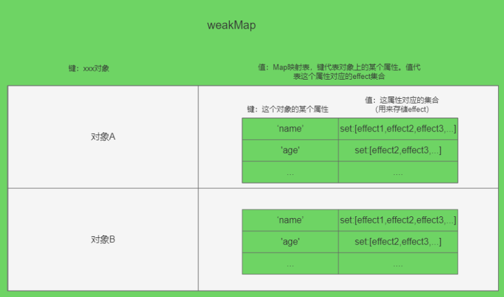

# Vue3 Reactivity

## 线上DEMO

stackBlitz:https://stackblitz.com/edit/stackblitz-webcontainer-api-starter-pzbq1g?file=index.html

github地址: https://github.com/Wadehl/vue-easy-reactivity


## Vue2

在Vue2里面，响应式主要是通过`Object.defineProperty`的`get()与set()`来收集依赖与通知依赖更新，总的来说就是`Object.defineProperty`+**发布订阅模式**实现的，而因为`Object.defineProperty`无法深层监听，所以需要递归实现深度监听。并且，由于原生只支持`get`与`set`，当我们向`Object`新增键或删除键的时候，这些都是不会被监听到的，需要调用`Vue.$set`才能实现新增的监听。


## Vue3

到了Vue3，出现了新的响应式系统`reactivity system`，依赖于这个系统，Vue的响应式变得更加强大了，主要的`API`为`reactive`于`ref`，下面实现一些简单点的版本。


**Vue源码对应的位置为：[core/packages/reactivity/src](https://github.com/vuejs/core/tree/main/packages/reactivity/src)，我们主要聚焦`baseHandlers`，`effect`，`reactive`和`ref`这几个文件**。

## reactive

`reactive`主要是针对引用类型进行处理的，`Vue`官方将合法类型分为`common`与`collection`。`common`即`object`与`array`，而`collection`为`Map/Set/WeakMap/WeakSet`这四类。

首先，`reactive`的实现离不开`ES6`新的API **`Proxy`**。

```js
const proxy = new Proxy(target, handler);
```

通过`handler`里面配置类似的`get,set`即可实现原本的效果，并且`Proxy`原生支持深层监听，不仅如此，`has`与`deleteProperty`更是支持了对查找与删除的监听，并且在对应的`get/has`收集依赖，在`set/deleteProperty`触发`effect`即可实现响应式系统。即`reactive`+`effect`+`handler`几个关键部分。


## 一个只针对obj类型的简单实现

### 1. 定义reactive函数

这里做的事情其实比较简单，就是定义了一个标识符，然后定义了一个缓存用的`WeakSet`，`createReactiveObject`通过判断缓存是否存在。这样做优化了性能，避免重复代理，最后依赖`proxy`实现。

```js
import { isObject } from './utils';
import { mutableHandlers, shallowMutableHandlers } from './baseHandlers.js'; // proxy handlers

export const ReactiveFlags = {
  isReactive: '__v_isReactive', // reactive的标识符
  RAW: '__v_isRaw'
}

export const reactiveMap = new WeakMap(); // weakmap缓存已经reactive的变量

export function reactive(target) {
  return createReactiveObject(
    target,
    mutableHandlers,
    reactiveMap,
  );
}

export function isReactive(target) {
  return !!target[ReactiveFlags.isReactive]; // 根据flag判断
}

function createReactiveObject(target, proxyHandlers, proxyMap) {
  if (!isObject(target)) {
    // 常规变量也直接返回
    return target;
  }
  const existingProxy = proxyMap.get(target);
  if (existingProxy) {
    // 缓存里有直接返回
    return existingProxy;
  }

  const proxy = new Proxy(target, proxyHandlers);
  proxyMap.set(target, proxy); // 新增缓存

  return proxy;
}
```


### 2. handlers的实现

`handlers`里主要的点在于依赖的收集，以及触发对应的`effect`，依赖收集主要是靠`track`函数，而触发`effect`则是依靠的`trigger`，那么只需要在访问的时候（`get/has`）进行收集，当修改的时候(`set/deleteProperty`)触发`effect`。

```js
import {
  reactive,
  ReactiveFlags,
  reactiveMap,
  shallowReactiveMap
} from './reactive.js';

import { isObject, hasOwn } from '../utils/index.js';
import { trigger, track } from './effect.js';

const createGetter = () => {
  return function get(target, key, receiver) {
    const isExistInMap = () => key === ReactiveFlags.RAW && (receiver === reactiveMap.get(target) || receiver === shallowReactiveMap.get(target));
    if (key === ReactiveFlags.isReactive) {
      return true;
    } else if (isExistInMap()) {
      return target;
    }
    const res = Reflect.get(target, key, receiver);
    track(target, 'get', key);
    if (isObject(res)) {
      return reactive(res); // 返回reative后的对象，deep
    }

    return res;
  }
}


const createSetter = () => {
  return function (target, key, val, receiver) {
    const res = Reflect.set(target, key, val, receiver);
    trigger(target, 'set', key);
    return res;
  }
}

const get = createGetter();
const set = createSetter();

function has(target, key) {
  const res = Reflect.has(target, key);
  track(target, 'has', key);
  return res;
}

function deleteProperty(target, key) {
  const hadKey = hasOwn(target, key);
  const res = Reflect.deleteProperty(target, key);
  if (res && hadKey) {
    trigger(target, 'delete', key);
  }
  return res;
}

export const mutableHandlers = {
  get,
  set,
  has,
  deleteProperty,
}
```

### 3. effect与track/trigger

`effect`是这里非常关键的一部分，它用于创建副作用函数，使得内部可以自动追踪内部响应式数据的变化，当监听到变化的时候会自动重新执行副作用函数。`Vue3`中的多个关键API-`watch/watchEffect/computed`都与它相关联。

下面是关键代码的简单实现：

`targetMap`用于存放监听的`targetObject`的`key`对应的依赖`depsSet`，`activeEffect`存储的是此时的`effect`。

`effect`实际上依赖于类`ReactiveEffect`，`parent`这个指针的存在主要是因为`effect`嵌套的问题，当我们嵌套后，`this`会指向最深的`effect`，此时我们对嵌套`effect`的依赖收集则会出现问题，通过`parent`改变`activeEffect`的指向，使得依赖能够被正确收集。

`track`与`trigger`的实现相对就简单一些了，就是往`targetMap`内添加/递归访问收集的依赖副作用`effect`，最后调用`run`来执行`effect.fn`。

`targetMap`数据结构图：



```js
const targetMap = new WeakMap();
let activeEffect = null;

export function effect(fn, options = {}) {
  if (fn.effect) {
    fn = fn.effect.fn; // 如果fn本来就是effect，就获取effect的fn 
  }

  const _effect = new ReactiveEffect(fn); // 构建新的effect

  if (!options || !options.lazy) {
    _effect.run();
  }

  const runner = _effect.run.bind(_effect);
  runner.effect = _effect;
  return runner;
}

class ReactiveEffect {
  deps = [];
  parent = activeEffect; // 指针，指向上一个effect
  constructor(fn) {
    this.fn = fn;
  }
  run() {
    try {
      this.parent = activeEffect; // 保存上一个activeEffect
      activeEffect = this;
      return this.fn();
    } finally {
      //cleanUpEffect(this) // 这里清理一些本次未被访问依赖deps，优化性能
      activeEffect = this.parent;
      this.parent = undefined;
    }
  }
}

export function track(target, type, key) {
  let depsMap = targetMap.get(target);
  if (!depsMap) {
    targetMap.set(target, (depsMap = new Map()));
  }
  let deps = depsMap.get(key);
  if (!deps) {
    deps = new Set();
  }
  if (!deps.has(activeEffect) && activeEffect) {
    deps.add(activeEffect);
  }
  depsMap.set(key, deps);
}

export function trigger(target, type, key) {
  /**
   * depsMap {
   *  deps: {
   *    key: [effect1, effect2, ...]
   *  }
   * }
   */
  const depsMap = targetMap.get(target);
  if (!depsMap) {
    return; // 没有依赖
  }
  const deps = depsMap.get(key);
  if (!deps) {
    return; // 依赖没有effect
  }
  deps.forEach((effectFn) => {
    effectFn.run();
  })
}
```

## Ref的实现

`ref`本质上类似于`Object.defineProperty`，只是用了`get value()`与`set value()`进行`track/trigger`，这也是为什么我们使用`ref`变量的时候，获取值需要使用`.value`的原因

```js
import { isObject } from "../utils/index.js";
import { track, trigger } from "./effect.js";
import { reactive } from "./reactive.js";

export function ref(val) {
  return createRef(val);
}

export function createRef(val) {
  if (isRef(val)) {
    return val;
  }
  return new RefImpl(val);
}

export function isRef(val) {
  return !!(val.__v_isRef && val); 
}

class RefImpl {
  constructor(val) {
    this.__v_isRef = true;
    this._val = convert(val);
  }
  get value() {
    track(this, 'get', 'value');
    return this._val;
  }
  set value(newVal) {
    trigger(this, 'set', 'value');
    this._val = convert(newVal);
  }
}

const convert = (val) => {
  return isObject(val) ? reactive(val) : val; 
}
```


## 总结

与`Vue2`相比，`Reactivity`改用了`Proxy`的方式实现了响应式，这样比起原本的`get/set`更多出了`hasOwn/delete/has`等多种API的响应式支持。不仅如此，通过`effect+track/trigger`实现的依赖收集替代了之前的`Watcher`的发布订阅者模式。另外，值得一提的是，`Vue3`中在响应式设计上考虑了层级嵌套依赖收集与清理不必要依赖的问题。

:::tips

在`Vue 3.2`中使用二进制标记位方式选择性增加与清理依赖dep，代替了原本`cleanup`（全清空）的方案，进一步优化了性能。[PR](https://github.com/vuejs/core/pull/4017)

:::
